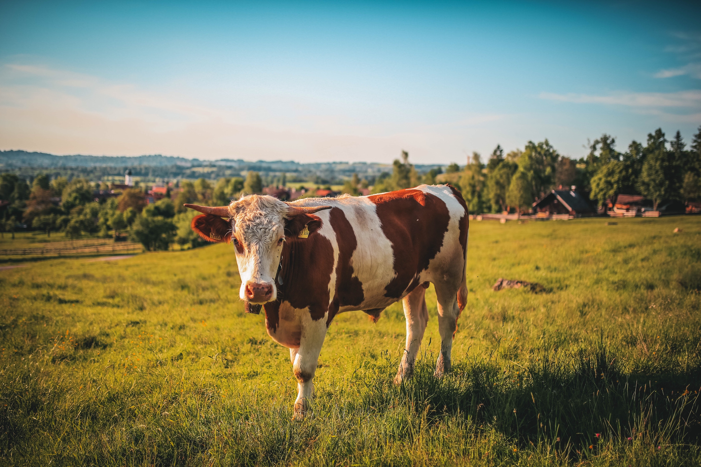

# **FraImage**

>  The word FraImage is just a word combination of Frame and Image **FraImage**.
 it's a website where you can frame images in less than a minute without having to edit lot of things.

## You just have to:
-  first upload your chosen image.
-  select the frame you want your image to have (e.g the frame size,the image / color of part of frame).
-  then after you are done download it by clicking the download button.

> ### Current version -1, -1 for not event finished yet AHHAHAHAHHAH.

> #### DISCLAIMER : I do not own every image in this website I put the owner of the image and also where I've found the image at the top of every img tage in the html file you can also see who own the image by hovering at the images in the website. 

##### I have nothing to say so just look at this beautfiul cow,how lovely this creature is.

copyrights&copy; Tobi   you can found it at https://www.pexels.com/photo/brown-and-white-cow-457447/
 